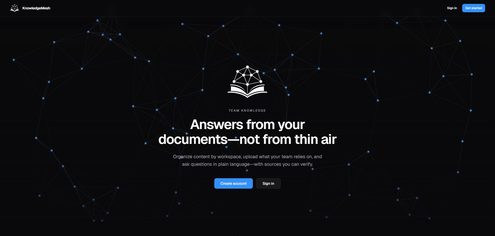

# KnowledgeMesh

**Your documents. One place to ask. Answers you can prove.**

## The problem

Team knowledge lives in PDFs, specs, and policies, but **getting an answer** still means guessing keywords and opening file after file. KnowledgeMesh is a **workspace-scoped** knowledge product: upload content, let it **index in the background**, then **ask in natural language** and get responses **tied to real passages**—with **citations**, not unchecked model text.

## What you’re looking at

A **multi-service RAG platform**: a **gateway** orchestrates **auth**, **ingestion**, **retrieval**, and **LLM** services. **PostgreSQL + pgvector** holds identities, workspaces, documents, and chunk embeddings; **Redis** backs the ingestion queue. A **worker** pulls jobs, extracts text, chunks, embeds, and writes vectors. Queries run **retrieve → generate**: top‑k chunks feed an LLM that returns **JSON** with **`answer`** + **`cited_indices`**; the gateway merges **citation metadata** for the UI.

**Edge:** NGINX serves the **Next.js** app and proxies **`/api/*`** to the gateway (the **`/api`** prefix is stripped so internal routes stay **`/v1/...`**). **Docker Compose** is the reference way to run the full stack, with **health-gated** startup so cold **502**s are rare.

## Stack

| Layer | Technologies |
|--------|----------------|
| **Web** | Next.js (App Router), React, TypeScript, Tailwind |
| **APIs** | Python, FastAPI, Pydantic, httpx |
| **Data** | PostgreSQL 16, **pgvector**, Redis |
| **AI** | OpenAI (embeddings + chat); optional **Ollama** for chat via **`LLM_PROVIDER`** |
| **Delivery** | Docker Compose, NGINX |

## What’s implemented

- **Identity & workspaces** — JWT auth, workspace membership, isolated libraries  
- **Documents** — upload, pipeline status, preview  
- **Ingestion** — async **Redis** queue; worker **extract → chunk → embed**  
- **Query** — semantic search + **citation-backed** answers; optional **MMR** reranking; **SSE streaming** path  
- **Dashboard** — indexed/processing counts + **queries in the last 24h**  
- **Ops-shaped** — gateway **rate limit** on query + **query/stream**, access logging, Compose health ordering, **diagnostics** API + UI  

## Go deeper

| Doc | Purpose |
|-----|---------|
| [`docs/how-to-run.md`](docs/how-to-run.md) | Docker Compose, ports, Ollama profile |
| [`docs/architecture.md`](docs/architecture.md) | Request paths, stores, security |
| [`docs/repository-structure.md`](docs/repository-structure.md) | Directory map, RAG diagram |
| [`docs/api-overview.md`](docs/api-overview.md) | HTTP surface |
| [`docs/milestones.md`](docs/milestones.md) | Delivery phases (all complete) |
| [`docs/decisions.md`](docs/decisions.md) | ADRs |
