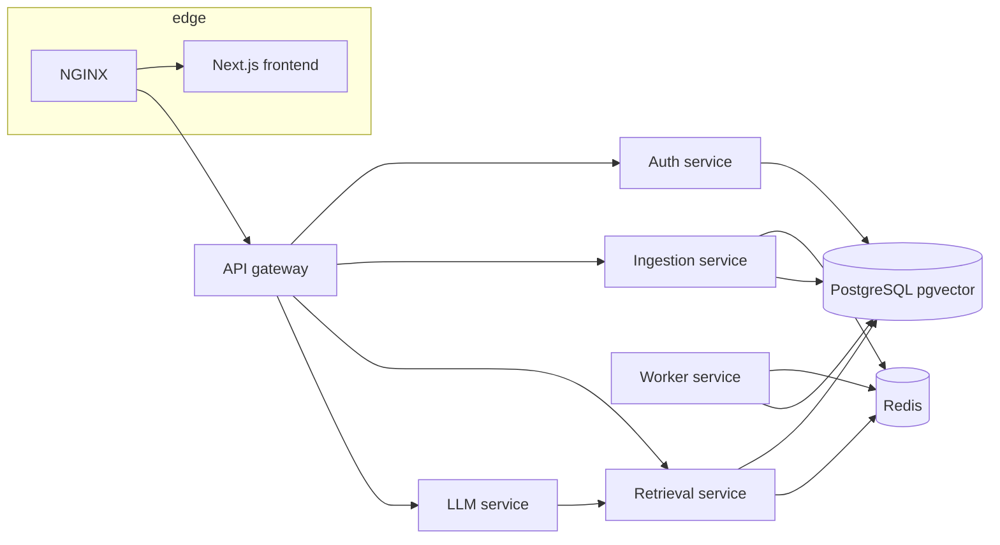

# KnowledgeMesh

**KnowledgeMesh** is a distributed [RAG] platform: users upload documents into **workspaces**, ingestion runs **asynchronously**, **embeddings** live in **PostgreSQL + pgvector**, and **semantic retrieval** grounds **LLM** answers with explicit **citations**. The system is intentionally multi-service—closer to production than a single-process demo.

## Problem

Teams need answers that are **traceable to source documents**, **isolated by workspace**, and **processed at scale** without blocking uploads. A credible solution separates **ingestion**, **retrieval**, **generation**, and **identity**, and uses a **queue** and **worker** pattern instead of synchronous “upload-and-chat” shortcuts.

## Architecture



- **Edge:** NGINX terminates HTTP and routes **`/`** to the frontend and **`/api/*`** to the gateway (path prefix stripped upstream).
- **Gateway:** Single public API surface; forwards to internal services (auth, ingestion, retrieval, LLM) and centralizes cross-cutting concerns (logging, auth forwarding, rate-limit hooks).
- **Auth:** Registration, login, JWT issuance/validation, workspace membership (expanded in Milestone 2).
- **Ingestion:** Upload handling, document metadata, enqueue processing jobs, status APIs.
- **Worker:** Dequeues jobs, extracts text, chunks with overlap, embeds, writes vectors + metadata, retries failures, updates document state.
- **Retrieval:** Query embedding, top-k similarity search, workspace-scoped filters, optional cache/rerank extension points.
- **LLM:** Prompt assembly, context packing, provider abstraction (OpenAI first; local/Ollama later), citation formatting.

## Service boundaries

| Component | Responsibility |
|-----------|----------------|
| `frontend/` | UI: auth flows, workspaces, documents, query + citations |
| `services/gateway-service/` | Public API aggregation and routing |
| `services/auth-service/` | Users, JWT, workspace roles |
| `services/ingestion-service/` | Uploads, metadata, job enqueue |
| `services/worker-service/` | Async pipeline to indexed chunks |
| `services/retrieval-service/` | Vector search and context retrieval |
| `services/llm-service/` | Grounded generation + citations |
| `shared/` | Cross-service schemas and small shared utilities |

## Tech stack

- **Frontend:** Next.js (App Router), TypeScript, Tailwind CSS  
- **Backend:** Python, FastAPI, Pydantic, SQLAlchemy (introduced with persistence)  
- **Data:** PostgreSQL 16 + **pgvector**, Redis (cache + queue transport)  
- **Ops:** Docker Compose, per-service Dockerfiles, NGINX reverse proxy  

## RAG flow

1. Upload document → metadata persisted → job **queued**  
2. Worker: extract → **chunk** (size + overlap configurable) → **embed** → store vectors  
3. Query → **embed query** → **semantic search** (workspace-scoped) → top-k chunks  
4. LLM: build prompt with retrieved context → generate answer → attach **citations** to sources  

Retrieval and generation stay **separate services** so scaling, caching, and provider swaps stay localized.

## Distributed systems concepts

- **Service decomposition** with a dedicated **gateway** and **health endpoints** for orchestration  
- **Async work** via **Redis-backed queues** and a **worker** pool pattern  
- **Stateful vs stateless** split: Postgres/pgvector for truth; Redis for ephemeral queue/cache  
- **Path-based routing** at NGINX for a single browser origin while keeping multiple backends  
- **Explicit document lifecycle** (`uploaded` → `queued` → `processing` → `indexed` / `failed`)  

## Repository layout

```
frontend/                 # Next.js app
services/                 # One folder per microservice
shared/                   # Shared Python modules (PYTHONPATH in images)
infra/nginx/              # Reverse proxy config
infra/scripts/            # Operational scripts (filled over time)
docs/                     # Architecture, milestones, API notes, ADRs
docker-compose.yml
.env.example
```

## Key features (roadmap)

- Workspace-scoped documents and permissions  
- Async ingestion with visible processing status  
- Citation-backed Q&A over retrieved chunks  
- Provider abstraction for LLM (and embeddings where it pays off)  

## Future improvements

- Streaming responses, conversation sessions, reranking  
- Metrics/tracing, CI/CD, hardened rate limiting  
- Optional **Ollama** / local inference mode  
- Richer RBAC and admin tooling  

## Documentation

- [`docs/architecture.md`](docs/architecture.md) — deeper structure and data flow  
- [`docs/milestones.md`](docs/milestones.md) — milestone tracker  
- [`docs/api-overview.md`](docs/api-overview.md) — evolving public API sketch  
- [`docs/decisions.md`](docs/decisions.md) — architectural decision log  

## License

Private / all rights reserved unless otherwise specified.
