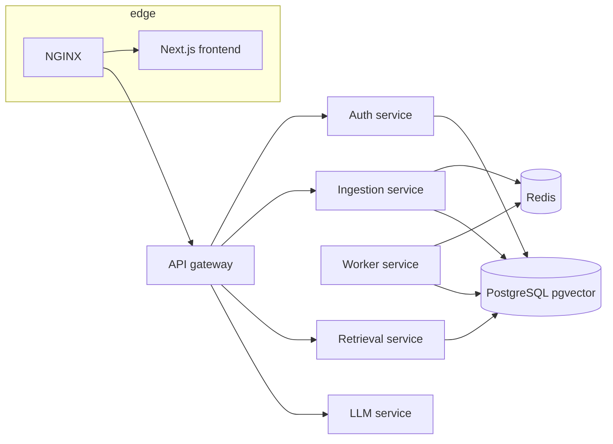

# Repository structure

Folder map and data flow. For HTTP routes see [`api-overview.md`](api-overview.md); for request path detail [`architecture.md`](architecture.md).

## Flow (high level)



## Service directories

| Path | Role |
|------|------|
| `frontend/` | Next.js UI: auth, workspaces, documents, query (incl. stream/MMR toggles), diagnostics |
| `services/gateway-service/` | Public API edge; native `query`, `query/stream`, `diagnostics`; proxies auth, ingestion, workspace paths |
| `services/auth-service/` | Users, JWT, workspaces, memberships |
| `services/ingestion-service/` | Uploads, documents API, stats, query-event analytics |
| `services/worker-service/` | Redis consumer: extract → chunk → embed → `document_chunks` |
| `services/retrieval-service/` | Query embedding, pgvector search, optional MMR |
| `services/llm-service/` | `rag/complete` + `rag/complete/stream`; OpenAI or Ollama (chat) |
| `shared/` | Shared Python schemas (`PYTHONPATH` in images) |

## RAG sequence

Upload → Redis job → worker writes chunks + vectors → query: retrieve (optional MMR) → LLM (JSON or SSE) → gateway merges citations for the client.

## `frontend/src/` (sketch)

- `app/` — `(marketing)/`, `(auth)/`, `(app)/` (dashboard, documents, query, admin/diagnostics, workspaces)
- `components/ui/` — primitives; `components/app/` — shell, `PageHeader`, nav icons
- `contexts/` — auth + workspace; `lib/api.ts` — `apiFetch` / `apiFetchRaw` to `/api/...`

## Repo layout

```
frontend/
services/{gateway,auth,ingestion,worker,retrieval,llm}-service/
shared/
infra/nginx/
infra/scripts/
docs/
docker-compose.yml
.env.example
```
