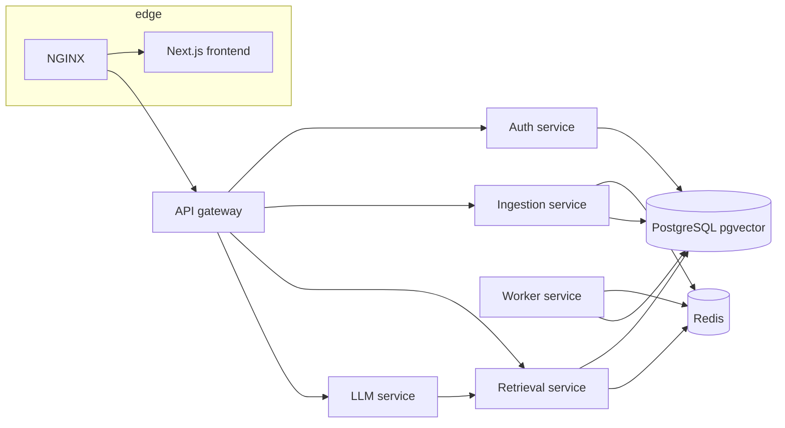

# Repository structure

Engineering-oriented map of KnowledgeMesh: services, data flow, and layout. For milestone planning see [`milestones.md`](milestones.md).

## High-level architecture



- **Edge:** NGINX serves the frontend and routes `/api/*` to the gateway (path prefix stripped upstream).
- **Gateway:** Single public API surface; forwards to internal services.
- **Auth:** Registration, login, JWT, workspace membership (expanded in later milestones).
- **Ingestion:** Uploads, metadata, job enqueue, status APIs.
- **Worker:** Async pipeline—extract text, chunk, embed, write vectors and metadata.
- **Retrieval:** Query embedding, top-k similarity search, workspace-scoped filters.
- **LLM:** Prompt assembly, grounded generation, citation formatting.

## Service boundaries

| Path | Role |
|------|------|
| `frontend/` | UI: auth, workspaces, documents, query + citations |
| `services/gateway-service/` | Public API edge; **proxies** `/v1/auth/*` and `/v1/workspaces/*` to auth (more prefixes later) |
| `services/auth-service/` | Users, bcrypt passwords, JWT, workspaces, memberships (SQLAlchemy + asyncpg) |
| `services/ingestion-service/` | Uploads, metadata, job enqueue |
| `services/worker-service/` | Async indexing pipeline |
| `services/retrieval-service/` | Vector search and context retrieval |
| `services/llm-service/` | Grounded generation + citations |
| `shared/` | Cross-service schemas and shared utilities |

## RAG flow

1. Upload document → metadata persisted → job **queued** (Redis).
2. Worker: extract → chunk (size/overlap configurable) → embed → store vectors in Postgres/pgvector.
3. Query → embed query → semantic search (workspace-scoped) → top-k chunks.
4. LLM: prompt with retrieved context → answer + **citations** to sources.

Retrieval and generation are separate services so scaling, caching, and provider changes stay localized.

## Design choices (summary)

- **Service decomposition** with a gateway and health endpoints for orchestration.
- **Async work** via Redis-backed queues and a worker pattern.
- **Postgres/pgvector** for durable vectors and metadata; **Redis** for queue/cache.
- **Path-based routing** at NGINX for one browser origin with multiple backends.
- **Document lifecycle:** `uploaded` → `queued` → `processing` → `indexed` / `failed`.

## Frontend layout (`frontend/src/`)

- **`app/`** — App Router: `(marketing)/` (landing), `(auth)/` (login, register), `(app)/` (shell + dashboard, documents, query).  
- **`components/ui/`** — Design-system primitives: `Button`, `Input`, `Label`, `Textarea`, `Card`, `Table`, `Badge`, `Spinner`, `EmptyState`, `LoadingState`, `ErrorState`.  
- **`components/app/`** — Shell: `AppShell`, `Sidebar`, `AppHeader`, `Logo`, `QueryForm`.  
- **`components/auth/`** — Login/register forms, **`AuthGate`** for protected routes.  
- **`contexts/`** — **`AuthProvider`** (token + `/v1/auth/me`), **`WorkspaceProvider`** (list + active workspace).  
- **`lib/api.ts`** — `apiFetch` to **`/api/...`** (dev rewrites → gateway).  
- **`lib/`** — `cn()`, `nav` config.

## Repository layout

```
frontend/                 # Next.js app
services/                 # One folder per backend service
shared/                   # Shared Python modules (PYTHONPATH in images)
infra/nginx/              # Reverse proxy config
infra/scripts/            # Operational scripts
docs/                     # Architecture, milestones, API notes, ADRs
docker-compose.yml
.env.example
```

## Related documentation

- [`architecture.md`](architecture.md) — deeper structure and data flow  
- [`milestones.md`](milestones.md) — milestone tracker  
- [`api-overview.md`](api-overview.md) — public API sketch  
- [`decisions.md`](decisions.md) — ADR-style log  
